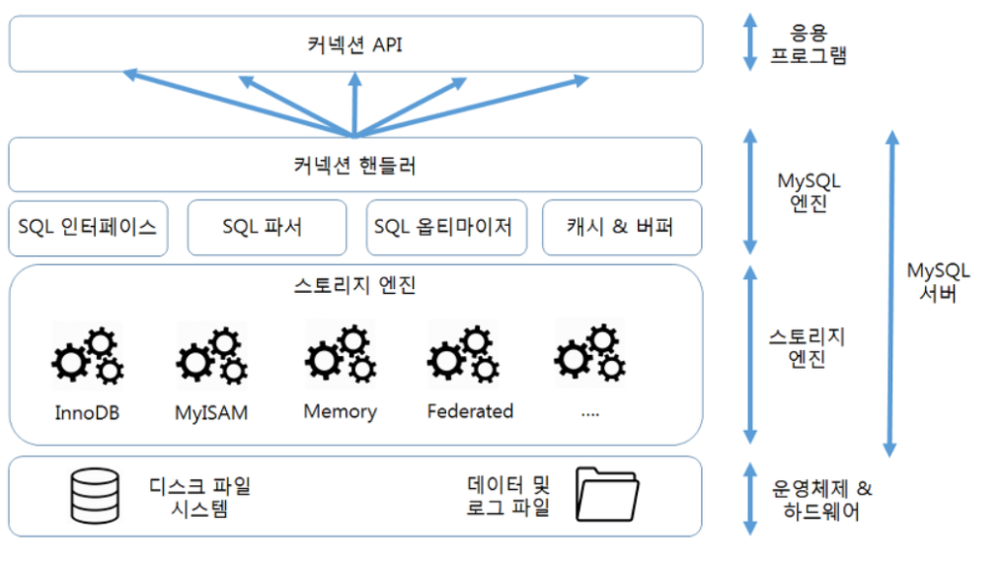
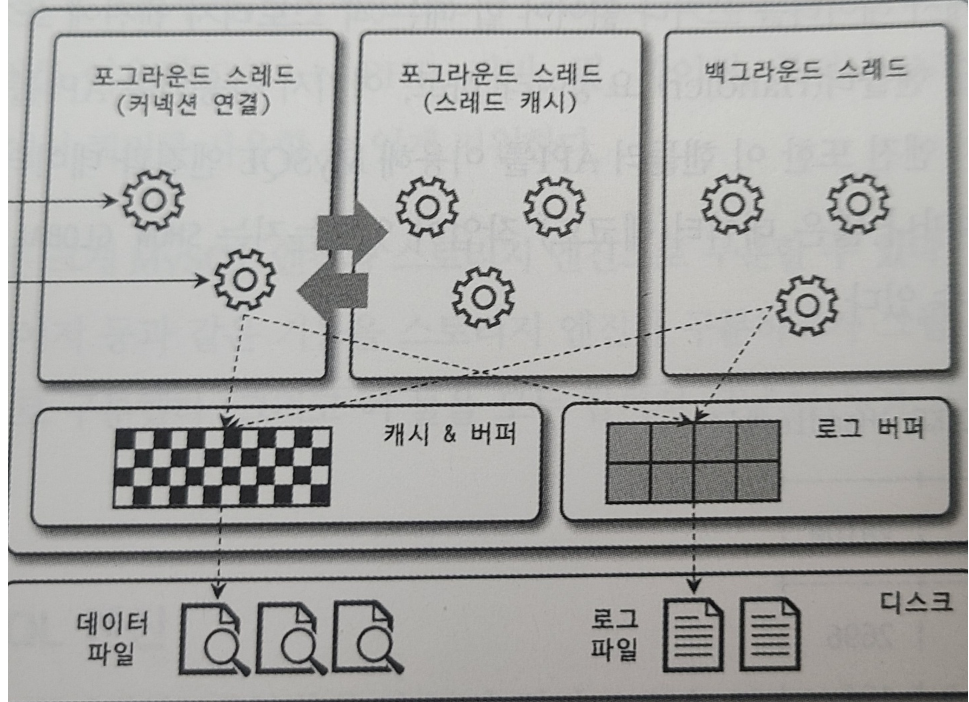
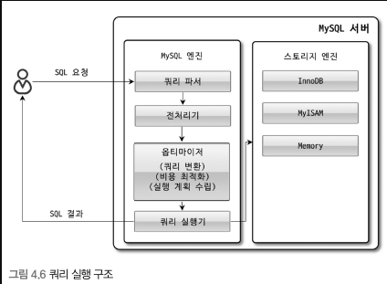

# MySQL의 전체 구조


MySQL 서버 = MySQL 엔진 + 스토리지 엔진  
## MySQL 엔진
- 커넥션핸들러: 클라이언트로부터의 접속, 쿼리 요청 처리
- SQL 파서: SQL 문장을 파싱 해주는 역할
- SQL 옵티마이저: SQL을 수행할 최적의 처리 경로를 생성해주는 핵심 역할
- 캐시 & 버퍼: 쿼리를 캐시해서 성능에 도움을 준다
## 스토리지 엔진
- 실제 데이터를 디스크에 저장하고 읽어오는 부분
- 스토리지 엔진은 여러 개를 동시에 사용할 수 있음.
```mysql
CREATE TABLE test(fd1 INT, fd2 INT) ENGINE = INNODB;
```
예시 코드처럼 테이블 생성시 ENGINE을 지정할 수 있다
# 스레딩 구조

MySQL은 스레드 기반으로 작동하며 포그라운드 스레드와 백그라운드 스레드로 구분할 수 있다.

**참고 프로세스와 스레드차이**
https://velog.io/@raejoonee/%ED%94%84%EB%A1%9C%EC%84%B8%EC%8A%A4%EC%99%80-%EC%8A%A4%EB%A0%88%EB%93%9C%EC%9D%98-%EC%B0%A8%EC%9D%B4

**포그라운드 작업**  
사용자가 입력한 명령이 실행되어 결과가 출력될 때까지 기다리는 방식으로 처리되는 작업  
**백그라운드 작업**    
사용자가 입력한 명령이 끝나는것과 상관없이 곧바로 다른 작업을 진행할 수 있는 작업
## 포그라운드 스레드
- 사용자가 요청하는 쿼리 문장 처리
- 일반적으로 사용이 종료되면 다시 스레드 캐시로 되돌아감
- 스레드 캐시는 thread_cache_size 시스템 변수의 값만큼만 존재함
- 데이터 버퍼 캐시, 디스크나 인덱스 파일로부터 데이터를 읽어온다.
## 백그라운드 스레드
InnoDB 기준으로 백그라운드로 처리되는 스레드는 다음과 같다.
- 인서트 버퍼 병합 스레드
- 로그 기록 스레드
- InnoDB 버퍼 풀의 데이터를 디스크에 기록하는 스레드
- 데이터를 버퍼로 읽어오는 스레드
- 잠금이나 데드락을 모니터링 하는 스레드

MySQL 5.5버전 부터는 쓰기 쓰레드와 읽기 스레드의 개수를 지정할 수 있게 되었고, 이는 시스템의 환경을 고려하여 적절하게 설정 하는 것이 좋다.  
또한 InnoDB의 경우에는 쓰기 작업을 버퍼링해서 일괄 처리하는 기능을 지원하지만, MyISAM은 지원하지 않는다.  

#메모리 할당 및 사용 구조
MySQL은 크게 글로벌 메모리 영역과 로컬 메모리 영역으로 구분할 수 있다.
## 글로벌 메모리 영역
클라이언트 스레드의 수와 무관하게 하나의 메모리 공간만 할당(필요에 따라 2개 이상의 할당 가능)  
모든 스레드에 의해 공유된다는 특징
- 테이블 캐시
- InnoDB 버퍼 풀
- InnoDB 어댑티브 해시 인덱스
- InnoDB 리두 로그 버퍼
## 로컬 메모리 영역
클라이언트 스레드가 쿼리를 차지하는데 사용하는 메모리 영역  
각 쿼리의 용도별로 필요할 때만 공간이 할당되고 필요하지 않은 경우에는 MySQL이 메모리 공간을 할당 하지 않을 수도 있다.  
- 정렬버퍼
- 조인버퍼
- 바이너리 로그 캐시
- 네트워크 버퍼
**팁**
글로벌 메모리 영역 로컬 메모리 영역의 크기는 주의해서 설정해야 한다.
# 쿼리 실행 구조

## 쿼리파서
쿼리 문장을 토큰(MySQL이 이해 할 수 있는 최소 단위의 어휘)으로 분리해 트리 형태의 구조로 만들어 내는 작업
## 전처리기
쿼리파서가 만든 파서트리를 기반으로 칼럼이름 또는 내장함수의 존재여부나 접근권한 등을 확인 하는 과정을 거친다
## 옵티마이저
쿼리 문장을 저렴한 비용으로 가장 빠르게 처리할지를 결정하는 역할 담당
## 실행엔진
옵티마이저가 만든 계획을 실행해주는 역할 (여러 핸들러 에게 요청을 보내는 역할)
## 핸들러(스토리지 엔진)
실행엔진의 요청에 따라 데이터를 디스크에 넣고 읽어 오는 역할 담당.
## 쿼리 캐시
SQL의 실행 결과를 메모리에 캐시하고, 동일 SQL 쿼리가 실행되면 테이블을 읽지 않고 즉시 결과를 반환 하는 기능  
MySQL8이 되면서 제거 되었다.
## 스레드 풀
- 사용자의 요청을 처리하는 스레드 개수를 줄여서 동시 처리되는 요청이 많다 하더라도 MySQL 서버의 CPU가 제한된 개수의 스레드 처리에만 집중할 수 있게 해서 서버의 자원 소모를 줄이는 것이 목적  
- 한마디로 동시에 실행중인 스레드들을 CPU가 최대한 잘 처리해낼 수 있는 수준으로 줄여서 처리하는 기능이다.  
- 적절한 스레드를 골라주면 CPU의 프로세서 친화도가 높아지고 불필요한 컨텍스트 스위치를 줄여서 오버헤드를 낮출 수 있다.  
- 일반적으로는 CPU 코어의 개수와 맞추는 것이 CPU 프로세서 친화도를 높이는데 좋다.
- 모든 스레드가 일을 하고 있다면 thread_pool_stall_limit 만큼 작업이 안끝날 경우 새로운 스레드를 추가한다.
- thread_pool_max_threads 에 설정된 값을 넘을 수 없다.

# InnoDB
## 프라이머리 키에 의한 클러스터링
- 모든 테이블은 프라이머리 키값의 순서대로 디스크에 저장 된다.(클러스터링)
- 프라이머리 키를 이용한 레인지 스캔은 빠르게 처리되기 때문에 실행 계획에서 비중이 높다.
## 외래 키 지원
- 부모 테이블과 자식 테이블 모두 인덱스 생성이 필요하다.
- 변경 시에는 반드시 부모 테이블이나 자식 테이블에 데이터가 있는지 체크하는 작업이 필요하므로 데드락이 발생할 가능성이 많으므로 주의하는 것이 좋다.
## MVCC(Multi Version Concurrency Control)
