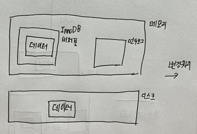
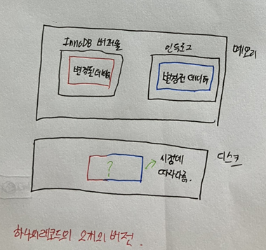
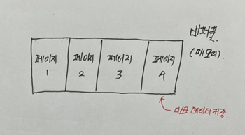
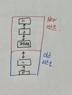
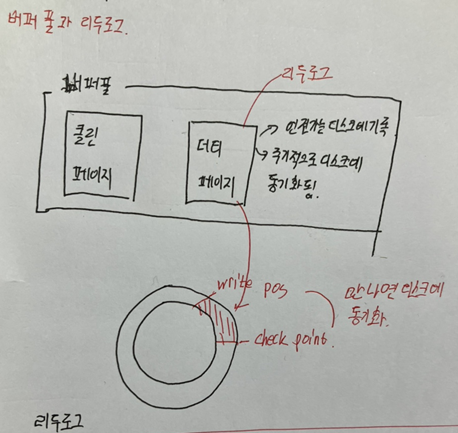
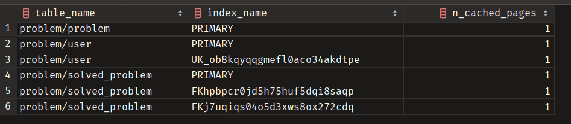

# InnoDB 스토리지 엔진 아키텍처
- 레코드기반 잠금 제공
- 높은 동시성 처리 안정적이며 성능이 좋음
## 프라이머리 키에의한 클러스터링
- 프라이머리 키를 기준으로 클러스터링함
- 프라이머리 키를 이용한 레인지 스캔이 빠르다
- 실행 계획에서 보조인덱스보다 선택될 가능성이 높다
- auto_increment를 사용하면 insert시에 재정렬이 안되기 때문에 좋음 (데이터 일관성 문제가 생긴다)
## 외래키 지원
- 외래키는 모두 인덱스 생성
- 변경시 부모 자식테이블에 데이터가 있는지 체크한다. (데드락 가능성이 높아진다)
- foreign_key_checks 옵션을 통해 외래키 지원을 ON/OFF 가능
```mysql
SET foreign_key_checks = OFF;
SET foreign_key_checks = ON;
```
## MVCC
 <br>
 <br>
- InnoDB 버퍼풀에는 데이터가 캐시되어 있다.
- 수정 쿼리가 들어오면 변경전 데이터를 언두로그에 저장한다.
- 이때 데이터에 대한 SELECT 쿼리가 들어오면 고립레벨에 따라 변경전 데이터를 읽거나 변경후 데이터를 읽는다.
- 디스크에 저장된 데이터는 보통 시점에따라 다르다.
- READ_UNCOMMITED의 경우에는 변경된 데이터를 읽는다.
- 그외에 경우에는 변경전 데이터를 읽는다.
- GIT 처럼 하나의 ROW에 대하여 2개의 버전을 가지고 있다.
- 이 기능을 통해서 트랜잭션 잠금을 하지않고 일관된 읽기가 가능하다.

## 자동 데드락 감지
- 데드락을 탐지하는 데드락 감지 스레드가 존재한다.
- 교착상태에 빠진 트랜잭션을 찾으면 언두로그가 적은 트랜잭션을 종료한다.
- 동시처리 스레드가 매우 많아지는 경우 이 기능 때문에 느려질 수 있다
- 자동 데드락 스레드를 멈추고 싶다면 innodb_deadlock_defect 옵션을 OFF하면 된다.

## InnoDB 버퍼 풀
### 버퍼 풀의 크기
- MySQL 5.7버전 부터는 버퍼 풀의 크기를 동적으로 설정할 수 있다.
- 각 설정은 적절한 값을 찾기 위해 성능을 측정하면서 늘려 가는 것이 좋다.
- 버퍼 풀의 크기 변경은 크리티컬한 변경이므로 DB서버가 한가한 시점을 골라 진행한다
- 버퍼 풀의 크기를 줄이는 작업은 서비스 영향도가 매우 크므로 한꺼번에 너무 많이 올리는 것을 경계해야한다.
- InnoDB 버퍼 풀은 innodb_buffer_pool_size 시스템 변수로 크기를 설정할 수 있다.
- InnoDB에서는 버퍼 풀을 여러개로 쪼개어 관리하게 되었다. (버퍼 풀 전체를 관리하는 세마포어 때문에 내부 잠금 경합이 많이 유발 되었음)
- innodb_buffer_pool_instances 시스템 변수를 이용해 버퍼 풀을 여러개로 분리해서 관리할 수 있다.
- 기본 값은 8개이고 메모리가 1GB 미만이면 1개로 설정됨.
- 자세한 설정 팁은 추후에 책을 참고하세요
### 버퍼 풀의 구조

- 버퍼풀은 메모리이고 메모리를 효율적으로 관리하기 위해서 페이지 단위로 관리한다.
- 페이지를 관리하기 위해서 LRU리스트, Flush리스트, 프리 리스트로 관리한다. <br>

**프리리스트** <br>
- 비어있는 페이지들 (여유 페이지) 
- 사용자의 쿼리가 새로운 데이터를 읽어올 때 사용 <br>

**LRU리스트** <br>
 <br>
- 디스크로부터 읽어온 페이지를 최대한 오래 캐시하기 위한 자료구조
- Cache Hit 될 때마다 New 리스트의 상단으로 이동
- 자주 읽히지 않는 데이터는 Old 리스트의 최하단으로 이동하다 삭제된다.

**플러시리스트** <br>
- 디스크에 동기화 되지 않은 데이터 페이지(더티페이지)의 목록을 관리한다.
- 데이터 변경이 가해진 더티 페이지는 플러시 리스트에 관리되며 특정 시점에 디스크에 기록됨(체크 포인트에 도달하면)
- 데이터가 변경되면 InnoDB는 변경 내용을 리두 로그에 기록하고 버퍼 풀의 데이터를 변경함

### 버퍼 풀과 리두 로그

- InnoDB의 버퍼 풀은 메모리를 크게 설정하면 쿼리의 성능이 좋아짐 (디스크의 모든 데이터 파일이 적재되지 않는 이상)
- 버퍼 풀의 메모리 공간만 늘리는 것은 데이터 캐시 기능만 향상됨
- 버퍼링 기능을 향상시키기 위해서는 체크 포인트 에이지를 이해 해야 한다.
- 가장 최근에 활성화된 체크 포인트의 지점과 마지막 리두 로그까지의 연결은 체크포인트 에이지라고한다(실제로는 LSN의 차이)
- 위 그림에서 write pos가 마지막 리두 로그라고 할 때 빨간색으로 색칠된 부분이 체크 포인트 에이지이다.
- 이 시점에서 wirte pos가 반시계 방향으로 증가하다가 check point를 만나게 되면 이벤트가 발생되어 더티 페이지가 동기화 된다
- 체크 포인트 에이지에 쌓인 만큼의 데이터가 버퍼링의 효과를 보는 데이터이다.
- 리두로그 파일의 크기만큼 버퍼링의 효과를 볼 수 있으므로 버퍼풀의 크기는 리두로그 파일보다 크기가 낮아야 효과를 볼 수 있다
- 리두로그 페이지 역시 서버의 스펙에 따라서 적절히 선택해 나가야 하는 값이다.
### 버퍼 풀 플러시
- 더티페이지를 동기화 시키는 기능 MySQL8 부터는 별 영향 없음
- 플러시 리스트 플러시(더티페이지를 디스크와 동기화 시키는 기능), 자세한 설명은 필요하면 정리
- LRU 리스트 플러시(사용 빈도가 낮은 데이터 페에지를 제거해서 새로 읽은 데이터를 저장할 페이지를 만드는 기능)로 구성됨

### 버퍼 풀 백업 및 복구
- 버퍼 풀에 데이터가 적재되어 있으면 쿼리 속도가 수십배 더 빠름
- 서버 점검 전에 버퍼풀 상태를 백업 시킬 수 있음
- ib_buffer_pool 이라는 파일로 새성된다.
```mysql
# 서버 셧다운 전에 버퍼 풀 상태 백업
SET GLOBAL innodb_buffer_pool_dump_now = ON;
# 서버 재시작 후 백업된 버퍼 풀의 상태 복구
SET GLOBAL innodb_buffer_pool_load_now = ON;
# 버퍼풀 복구 과정 확인 하는 쿼리
SHOW STATUS LIKE 'Innodb_buffer_pool_dump_status' \G
# 버퍼풀 복구 멈추는 쿼리
SET GLOBAL innodb_buffer_pool_load_abort =ON;
```
### 버퍼 풀 적재 내용 확인
- MySQL 5.6의 information_schema 데이터베이스의 innodb_buffer_page 테이블에서 버퍼 풀의 메모리에 페이지 확인 가능 했으나 성능이 구림
- MySQL 8버전부터는 이러한 문제점을 해결하기 위해 innodb_cached_indexes 테이블이 새로 추가됨

```mysql
SELECT
    it.NAME table_name,
    ii.NAME index_name,
    ici.N_CACHED_PAGES n_cached_pages
FROM information_schema.INNODB_TABLES it
         inner join information_schema.INNODB_INDEXES ii on ii.TABLE_ID = it.TABLE_ID
         inner join information_schema.INNODB_CACHED_INDEXES ici on ici.INDEX_ID = ii.INDEX_ID
where it.NAME in ('problem/problem', 'problem/user', 'problem/solved_problem');
```
 <br>
- 데이터가 작아서 그런지 페이지가 1개씩 뿐이다.
### Double Write Buffer
- 더티 페이지를 플러시할 때 장애가 나면 페이지 내용을 복구할 수 없을 수도 있다
- 이러한 문제를 막기 위해 사용하는 기법이 Double-Write기법
- A, B, C ,D ,E의 더티페이지를 플러시한다고 할 때 플러시 하기전에 DobuleWrite 버퍼에 미리 기록
- 이후에 더티페이지 플러시 진행
- 시스템에 장애가 나서 페이지 플러시에 장애가 나게 되면 재시작 될 때 DobuleWrite 버퍼의 내용과 데이터 파일이 다를 경우 동기화 시킴
- innodb_doublewrite 시스템 변수로 제어 가능
