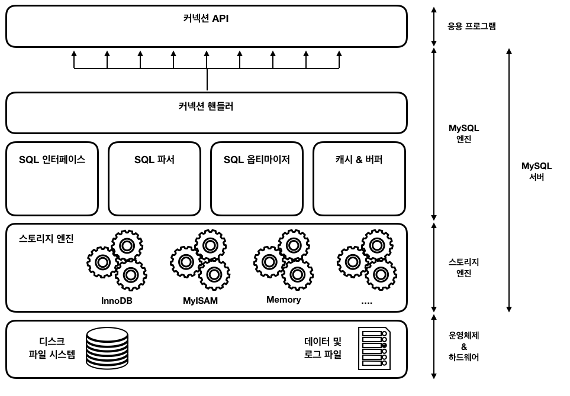
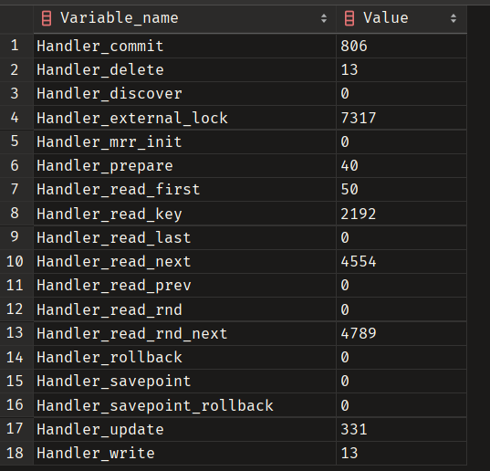
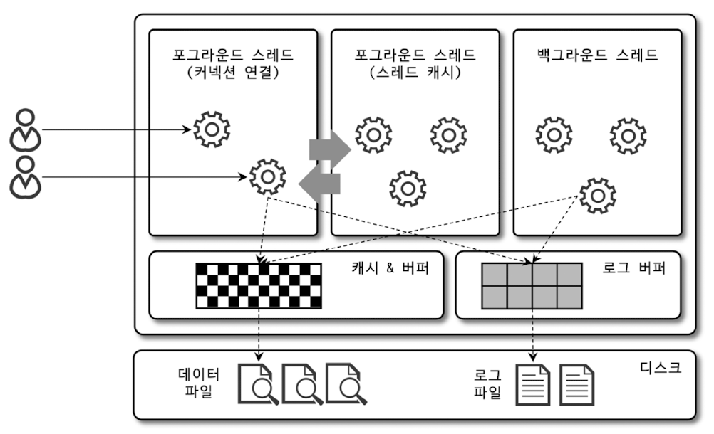
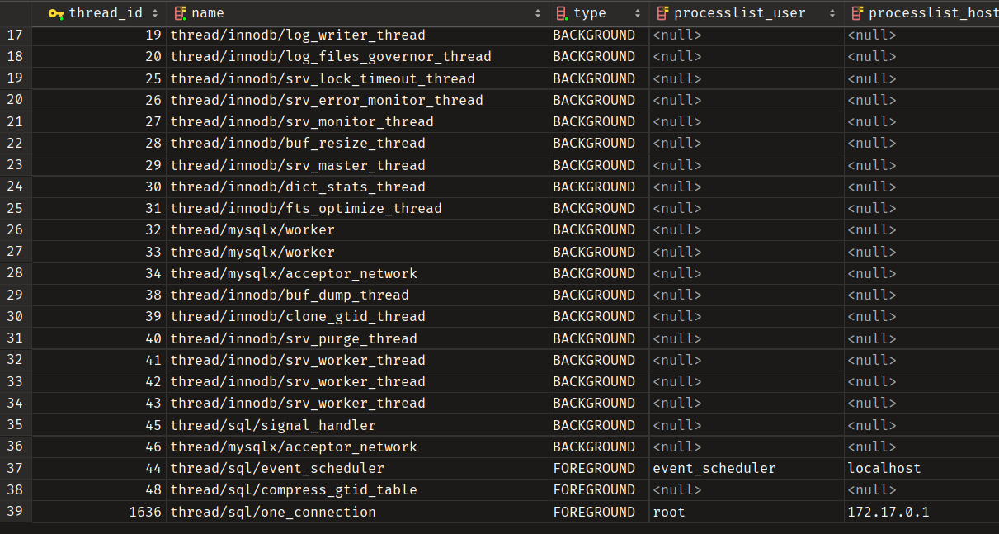

# MySQL 엔진 아키텍처

MySQL서버 = MySQL엔진 + 스토리지 엔진
# MySQL엔진
- 커넥션 핸들러: ?
- SQL 파서: 쿼리문을 토큰단위로 분리하여 트리 형태의 구조를 만드는 단계. 이 단계에서 쿼리 기본 문법의 에러 발견이 된다. 
- 전처리기: 쿼리파서에서 만들어진 파서트리를 기반으로 쿼리 문장의 구조적인 문제점을 확인하는 단계. 토큰을 테이블의 이름, 컬럼의 이름, 내장 함수와 같은 개체를 매핑해 객체의 존재여부와 객체의 접근 권한들을 확인하는 과정. 실제 존재하지 않거나 권한상 사용할 수 없는 토큰들이 걸러지는 단계.  
- 옵티마이저: 쿼리를 저렴한 비용으로 가장 빠르게 처리할지를 결정하는 단계.
# 스토리지 엔진
실제 데이터를 디스크 스토리지에 저장하거나 읽어오는 부분<br>
스토리지 엔진은 여러 개를 동시에 등록할 수 있다.(어떤 게 제일 좋을까?)
- MySQL엔진이 데이터에 관한 요청(CRUD)을 하는데 이를 핸들러 요청이라고 한다.
- 핸들러 요청에서 사용하는 API를 핸들러 API라고 한다.
```mysql
SHOW GLOBAL STATUS LIKE 'Handler%'
```
쿼리를 활용하여 핸들러 API를 통해 얼마나 많은 데이터 작업이 있었는지 확인 할 수 있다.

# MySQL스레딩구조

**포그라운드 작업**<br>
사용자가 입력한 명령이 실행되어 결과가 출력될 때까지 기다리는 방식으로 처리되는 작업
**백그라운드 작업**<br>
사용자가 입력한 명령이 끝나는것과 상관없이 곧바로 다른 작업을 진행할 수 있는 작업
<br>
아래 쿼리를 이용해 실제 실행중인 스레드를 확인할 수 있다.
```mysql
SELECT thread_id, name, type, processlist_user, processlist_host
FROM performance_schema.threads ORDER BY type, thread_id
```

실제로 확인해 보니 백그라운드 스레드는 DB 처리를 위한 스레드들이 할당되어 있는것으로 보이고 포그라운드 스레드는 커넥션 연결에 사용되는 것을 볼 수 있다.
## 포그라운드 스레드
- MySQL 서버에 접속된 클라이언트 수만큼 존재
- 쿼리 문장 처리
- 커넥션이 종료되면 스레드는 다시 스레드 캐시로 되돌아간다.
- 스레드 캐시는 thread_cache_size 만큼만 존재한다.
- 데이터를 MySQL의 버퍼나 캐시로부터 가져온다, 버퍼나 캐시에 없을 경우 직접 디스크 데이터나 인덱스를 읽어온다.
- MyISAM 테이블은 디스크 쓰기 작업까지 포그라운드 스레드가 처리하지만 InnoDB 테이블은 데이터 버퍼나 캐시까지만 포그라운드 스레드가 처리하고 나머지 버퍼로부터 디스크까지 기록하는 작업은 백그라운드 스레드가 처리한다.
## 백그라운드 스레드
InnoDB 기준으로 다음과 같은 작업이 백그라운드로 처리 된다.
- 인서트 버퍼를 병합하는 스레드
- 로그를 디스크로 기록하는 스레드
- InnoDB 버퍼 풀의 데이터를 디스크에 기록하는 스레드
- 데이터를 버퍼로 읽어 오는 스레드
- 잠금이나 데드락을 모니터링 하는 스레드
