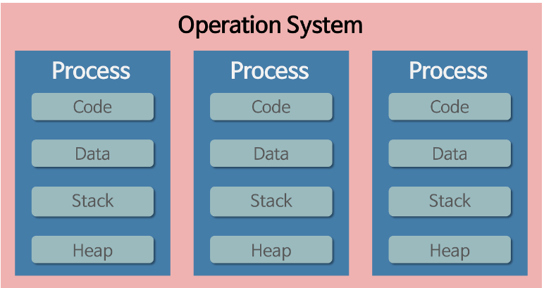
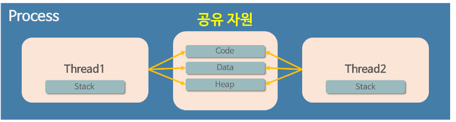

# 프로세스와 스레드에 대한 정의
> 프로세스: 운영체제로부터 자원을 할당받은 작업의 단위 
> 스레드: 프로세스가 할당받은 자원을 이용하는 실행흐름의 단위

# 프로그램 -> 프로세스 -> 스레드
## 프로그램 -> 프로세스
> 프로그램이란, 파일이 저장 장치에 저장되어 있지만 메모리에는 올라가 있지 않은 정적인 상태
- 메모리에 올라가 있지 않았다: 운영체제가 프로그램을 실행 시키지 않았다는 뜻
프로그램이란 실행되지 않은 파일을 가르키는 말이다.
> 프로세스란 메모리에 올라가서 실행중인 상태의 프로그램
## 프로세스 -> 스레드
- 과거에는 프로세스 하나만을 사용해서 프로그램이 진행 되었다고 함.
- 프로그램의 복잡도가 증가하며 하나의 프로세스 만으로는 처리하기가 어려워짐
- 한 프로그램을 처리하기 위한 프로세스를 여러개 만들면 되지 않나?(불가능 하다고 하는데 멀티 프로세스 있지않나?)
- 아무튼 프로세스와는 다른 더 작은 실행 단위 개념이 필요하게 되었고 그러한 개념이 바로 스레드임
- 스레드는 프로세스와 달리 다른 스레드간 메모리를 공유하며 작동한다.
- 프로세스의 자원을 스레드끼리 공유한다는 것임

[//]: # (TODO 동기화 문제 정리 하기)

## 프로세스와 스레드의 작동 방식에 대한 디테일
- 프로세스는 메모리에 올라갈 때 운영체제로부터 시스템 자원을 할당 받는다.
- 프로세스마다 각각 독립된 메모리 영역을 Code/Data/Stack/Heap 형식으로 할당해줌
- 서로 다른 프로세스끼리는 통신을 위해서 IPC가 필요하다.

- 이와 다르게 스레드는 프로세스가 할당 받은 메모리 영역내에서 Stack 영역은 따로 할당 받고 나머지 Code/Data/Heap 형식으로 할당된 메모리 영역을 공유한다. 

- 프로세스는 강제 종료되더라도 다른 프로세스에 별도의 영향이 없음
- 스레드의 경우에는 메모리 영역을 공유하기 때문에 스레드의 오류가 모든 스레드로 전파되서 종료됨
